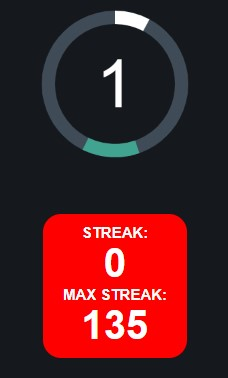

# NoPixel_Lockpick_Bot
Script that uses computer vision to do lockpick minigame for you

## Dependencies

1. Everything in the [requirements.txt](requirements.txt)

## Usage
``` python NoPixel_Lockpick_Bot.py```

## Config

You will have to update the zone for your screen resolution
```
zone = {"top": 169, "left": 1190, "width": 184, "height": 161}
```

Tested on https://sharkiller.ddns.net/nopixel_minigame/lockpicks/

